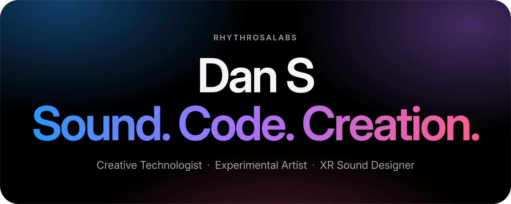
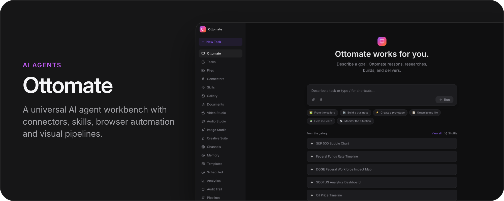
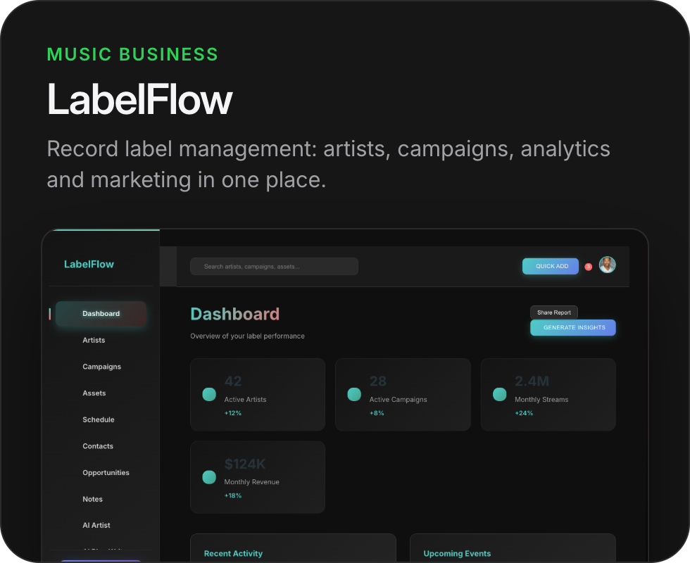
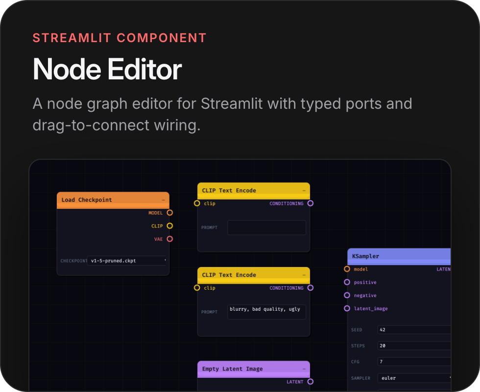
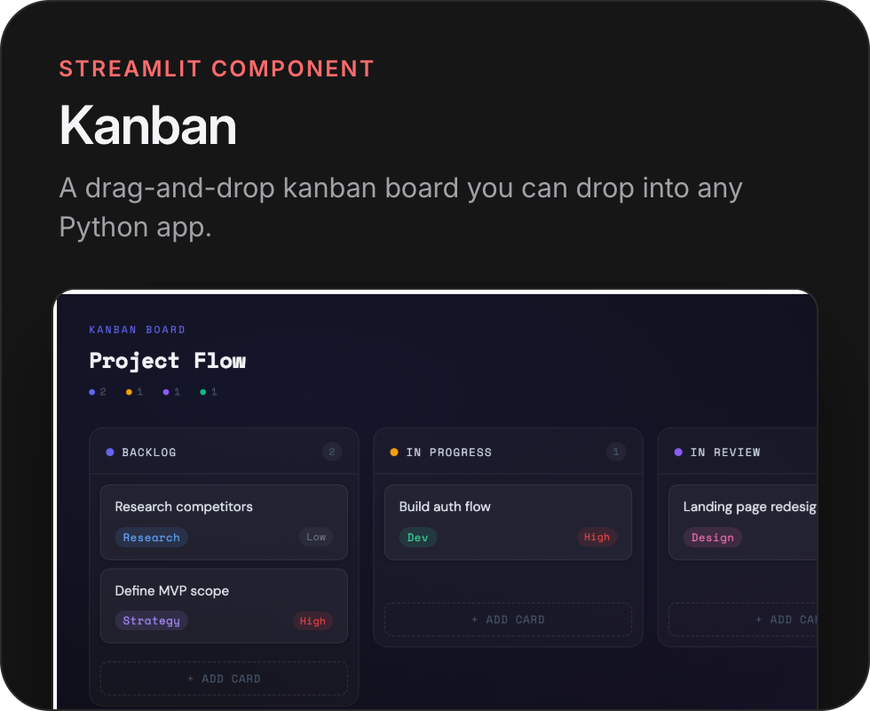
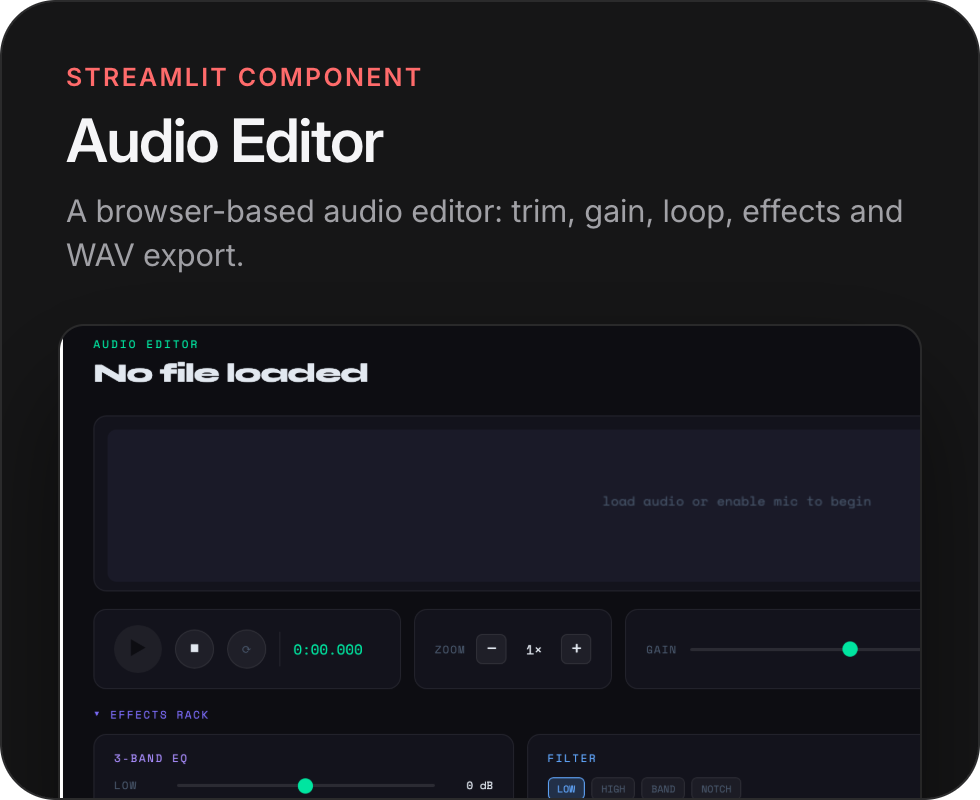
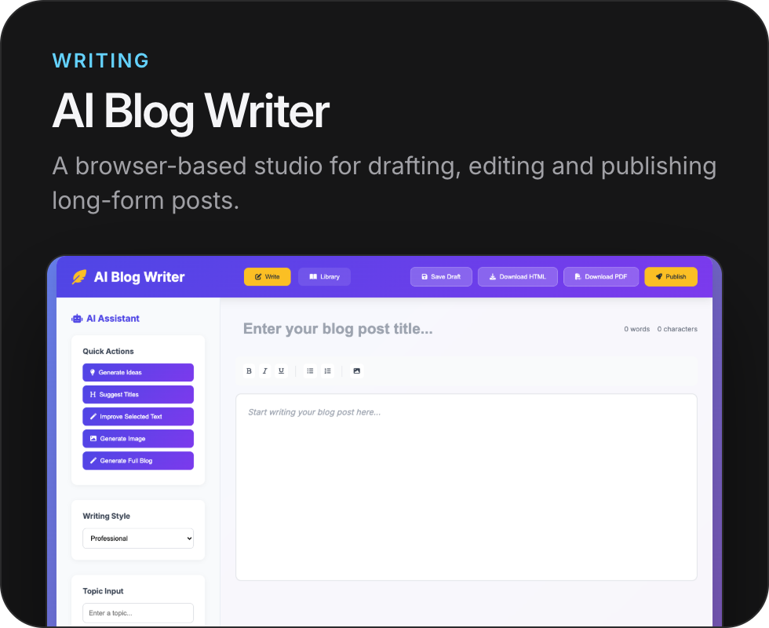
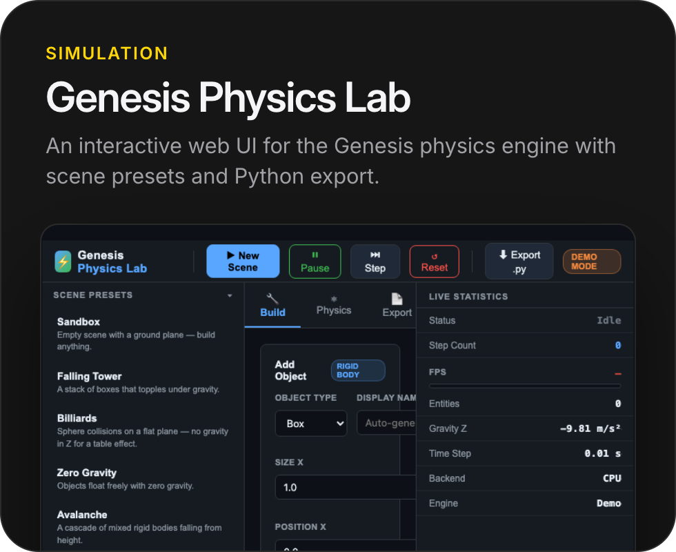

<picture><source media="(prefers-color-scheme: dark)" srcset="assets/hero-dark.png"><source media="(prefers-color-scheme: light)" srcset="assets/hero-light.png"></picture>

 

<a href="https://rhythrosalabs.github.io/"><picture><source media="(prefers-color-scheme: dark)" srcset="assets/pill-portfolio-dark.png"><source media="(prefers-color-scheme: light)" srcset="assets/pill-portfolio-light.png"></picture></a>
<a href="https://linkedin.com/in/danielsheils"><picture><source media="(prefers-color-scheme: dark)" srcset="assets/pill-linkedin-dark.png"><source media="(prefers-color-scheme: light)" srcset="assets/pill-linkedin-light.png"></picture></a>
<a href="https://share.streamlit.io/user/rhythrosalabs"><picture><source media="(prefers-color-scheme: dark)" srcset="assets/pill-streamlit-dark.png"><source media="(prefers-color-scheme: light)" srcset="assets/pill-streamlit-light.png"></picture></a>
<a href="https://github.com/RhythrosaLabs?tab=achievements"><picture><source media="(prefers-color-scheme: dark)" srcset="assets/pill-starstruck-dark.png"><source media="(prefers-color-scheme: light)" srcset="assets/pill-starstruck-light.png"></picture></a>

  

I build at the intersection of sound, code, and visual media, with 18+ years across audio engineering, music, interactive media, and software. 
Streamlit Ambassador (formerly Streamlit Creator).

## 🎛️ About

I am a multidisciplinary builder with 18+ years of experience across audio engineering, music production, sound design, game development, AI tooling, and creative software.

- Nearly 30 solo and collaborative albums
- Hundreds of studio and live collaborations
- Enterprise AR/XR sound design for Red Bull, Microsoft, Intel, Amazon, Motorola, Lenovo, San Diego Padres, The Glenlivet, and the Alzheimer's Association
- End-to-end product work from concept and design to engineering and launch

I focus on production-ready systems where AI is deeply integrated into real creative workflows, with sustained open-source activity and recognized GitHub achievements.

## 🚀 Focus Areas

- AI-powered creative platforms for audio, video, and content production
- Autonomous agent systems for research, planning, coding, and media generation
- Interactive experiences in Unity and browser-based environments
- Custom Streamlit components and full-stack tooling for creative teams
- Multimedia pipelines combining Python, TypeScript, and modern AI APIs

## 🧰 Tech + Creative Stack

	

	
	
	
	

## 🌟 Featured Projects

<a href="https://github.com/RhythrosaLabs/otto-mate-2"><picture><source media="(prefers-color-scheme: dark)" srcset="assets/card-ottomate-dark.png"><source media="(prefers-color-scheme: light)" srcset="assets/card-ottomate-light.png"></picture></a>

<a href="https://github.com/RhythrosaLabs/labelflow"><picture><source media="(prefers-color-scheme: dark)" srcset="assets/card-labelflow-dark.png"><source media="(prefers-color-scheme: light)" srcset="assets/card-labelflow-light.png"></picture></a>
<a href="https://github.com/RhythrosaLabs/streamlit-node-editor"><picture><source media="(prefers-color-scheme: dark)" srcset="assets/card-node-editor-dark.png"><source media="(prefers-color-scheme: light)" srcset="assets/card-node-editor-light.png"></picture></a>

<a href="https://github.com/RhythrosaLabs/streamlit-kanban"><picture><source media="(prefers-color-scheme: dark)" srcset="assets/card-kanban-dark.png"><source media="(prefers-color-scheme: light)" srcset="assets/card-kanban-light.png"></picture></a>
<a href="https://github.com/RhythrosaLabs/streamlit-audio-editor"><picture><source media="(prefers-color-scheme: dark)" srcset="assets/card-audio-editor-dark.png"><source media="(prefers-color-scheme: light)" srcset="assets/card-audio-editor-light.png"></picture></a>

<a href="https://github.com/RhythrosaLabs/ai-blog-writer"><picture><source media="(prefers-color-scheme: dark)" srcset="assets/card-blog-writer-dark.png"><source media="(prefers-color-scheme: light)" srcset="assets/card-blog-writer-light.png"></picture></a>
<a href="https://github.com/RhythrosaLabs/genesis-physics-lab"><picture><source media="(prefers-color-scheme: dark)" srcset="assets/card-genesis-dark.png"><source media="(prefers-color-scheme: light)" srcset="assets/card-genesis-light.png"></picture></a>

Built in public with an emphasis on practical outcomes, collaborative development, and consistent shipping.

| Project | What it does |
|---|---|
| [Ottomate](https://github.com/RhythrosaLabs/otto-mate-2) | Universal AI agent workbench with connectors, skills, browser automation, and visual pipelines |
| [Soundstorm](https://github.com/RhythrosaLabs/soundstorm) | AI-driven audio manipulation platform for sound design and experimental composition. ⭐ Earned GitHub Starstruck trophy |
| [DuoGPT](https://github.com/RhythrosaLabs/DuoGPT) | Multi-agent GPT experimentation for collaborative ideation and content workflows |
| [LabelFlow](https://github.com/RhythrosaLabs/labelflow) | Record label management platform built with React + Vite |
| [Autonomous Business Platform](https://github.com/RhythrosaLabs/autonomous-business-platform) | AI automation for marketing, content operations, and business workflows |
| [Multi-Agent Viral Video Maker](https://github.com/RhythrosaLabs/multi-agent-viral-video-maker) | End-to-end multi-agent pipeline that generates longform videos with voice and music |
| [AI Blog Writer](https://github.com/RhythrosaLabs/ai-blog-writer) | Browser-based AI writing studio for drafting, editing, and publishing long-form content |
| [Game Maker](https://github.com/RhythrosaLabs/Game-Maker) | AI-accelerated game tooling for concepts, scripts, assets, music, and 3D content |
| [Streamlit Components Demo](https://github.com/RhythrosaLabs/streamlit-components-demo) | Production-grade custom Streamlit components |
| [InteractiveSoundAndArt](https://github.com/RhythrosaLabs/InteractiveSoundAndArt) | Unity-based interactive portfolio and virtual museum |

## 🏆 GitHub Recognition

- 🌟 Soundstorm earned GitHub Starstruck.
- ⭐ GitHub achievements include YOLO, Starstruck, and Pull Shark x2.
- 🤝 Active open-source collaboration across AI tooling, creative software, and multimedia systems.

## 🎚️ Experience Highlights

- Freelance Creative Technologist (2008-Present): audio, software, game development, design, and media production
- Streamlit Ambassador (2025-Present): joined as a Streamlit Creator, the program's earlier name; recognized for AI-powered creative tools and consistent open-source delivery
- Sound Designer, Rock Paper Reality (2023-2024): enterprise AR/XR audio experiences
- Course Instructor, The Westport Library (2020-2022): introductory game design and generative AI courses
- Lead Sound Technician, Town of Greenwich (2014-2018): live event audio operations and team leadership
- Radio Producer roles (2008-2018): production, stingers, podcast editing, and broadcast audio

## 🧪 Currently Building

- Otto-Mate 2: expanding autonomous agent workflows, orchestration depth, and connector coverage
- AI-native production tooling for creative and business automation pipelines
- AI-accelerated game development systems for concepting, assets, scripting, and iteration

## 🤝 Collaboration

Open to collaborations, commissions, and partnerships in:

- AI product development
- Audio and XR sound design
- Interactive media and game tooling
- Creative automation systems

## 💛 Support

If this project is useful to you, consider supporting development:

👉 [Donate via PayPal](https://paypal.me/noodlebake) — @noodlebake
